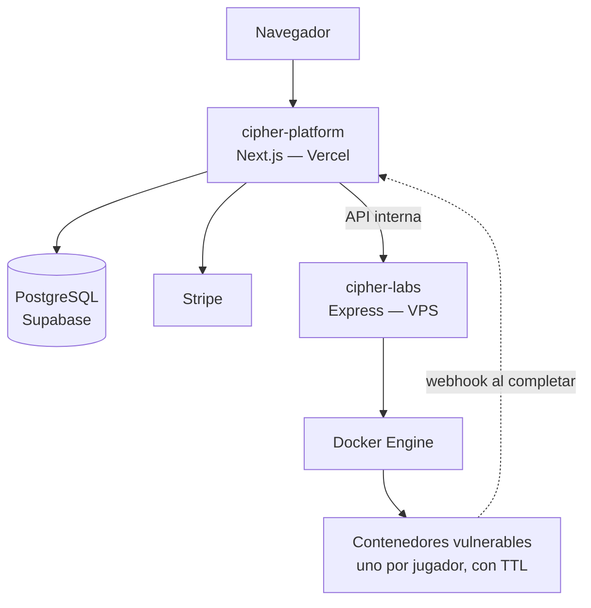

# Cipher

Cipher es un proyecto personal que desarrollé durante la universidad, combinando dos áreas que me interesan: la seguridad ofensiva y el desarrollo web full-stack. La motivación de partida era construir una plataforma de formación en ciberseguridad distinta a un CTF tradicional: retos con contexto narrativo y laboratorios vulnerables que se despliegan bajo demanda.

No es un producto terminado — es el proyecto en el que he podido aplicar de forma más completa arquitectura de software, integración de servicios externos y seguridad aplicada.

## Qué hay dentro

Son dos servicios separados:

- **`cipher-platform`** — la plataforma web. Next.js, catálogo de retos, autenticación, pagos con Stripe, progreso del jugador, leaderboard y certificados.
- **`cipher-labs`** — un servicio independiente en Express que orquesta contenedores Docker vulnerables bajo demanda: uno por jugador, con límites de recursos, y con autodestrucción a las dos horas.

Ambos se comunican por una API REST interna autenticada con una clave compartida.

Sobre esa base hay dos modos de juego:

- **Operación SHUTTER** — un CTF narrativo de 5 niveles (reconocimiento web, SQL injection, forense/OSINT, JWT + IDOR, geolocalización) construido sobre una historia.
- **Cipher Arena** — un modo más ligero pensado como calentamiento: mini-labs de vulnerabilidades comunes (SQLi, IDOR, JWT, SSRF, XXE...) resueltos directamente en el navegador, sin contenedores, en partidas cortas y contrarreloj. La referencia de diseño fue el formato de scroll rápido de apps tipo TikTok, adaptado a retos de ciberseguridad para bajar la barrera de entrada antes de enfrentarse a un laboratorio real.

## Arquitectura

La separación entre plataforma y labs fue una decisión deliberada: la web necesita poder desplegarse en un entorno serverless (Vercel), mientras que orquestar contenedores Docker requiere un proceso persistente con acceso al demonio Docker. Ese componente vive en un VPS independiente y se comunica con la plataforma mediante una API mínima.

Dentro de `cipher-platform` se aplicó arquitectura hexagonal: el dominio (entidades, casos de uso) no depende de Prisma, Stripe ni de Next.js. La comunicación con el exterior se hace a través de interfaces (puertos) que implementan los adaptadores correspondientes — el repositorio de Prisma, el cliente de Stripe, el cliente HTTP hacia `cipher-labs`. Esto permite testear los casos de uso sin depender de una base de datos real.

## Stack

| | |
|---|---|
| Frontend | Next.js 16 (App Router) + React 19 + TypeScript + Tailwind |
| API | API routes de Next.js, validadas con Zod |
| Base de datos | PostgreSQL vía Prisma, hosteada en Supabase (también su servicio de Auth) |
| Pagos | Stripe — Checkout + webhooks |
| Orquestación de labs | Express + TypeScript + dockerode, sobre un VPS |
| Caché | Redis (Upstash) para el catálogo |
| Tests | Vitest — unos 280 tests entre dominio y API routes |

## Metodología y herramientas de desarrollo

El desarrollo siguió un enfoque de Spec Driven Development (SDD): antes de implementar cada funcionalidad se documentaba su especificación — arquitectura, contratos de API, modelo de datos y criterios de aceptación — en los documentos que se mantienen en el repositorio (`01_ARCHITECTURE.md` a `06_SHUTTER_COMPLETE.md`). Esa documentación sirvió como referencia tanto para el desarrollo manual como para dirigir herramientas de programación agéntica, concretamente Claude Code, que se emplearon en la fase de implementación una vez definidos los requisitos y la arquitectura.

Mi trabajo combinó la programación manual de partes clave del código con el diseño del sistema: la arquitectura hexagonal, la relación entre cipher-platform y cipher-labs, el modelo de datos, los criterios de seguridad y las especificaciones funcionales, además de la revisión de código, la auditoría de seguridad del flujo de laboratorios Docker. Trabajar de este modo — alternando el desarrollo manual directo con la especificación, dirección y auditoría del código asistido — es en sí mismo parte de lo que este proyecto me ha permitido practicar, y un flujo de trabajo cada vez más habitual en el desarrollo de software profesional.

## Estado actual

Es un proyecto personal, no un sistema en producción con usuarios reales, y eso condiciona su estado:

- **Funciona de forma completa**: registro, autenticación, catálogo, compra con Stripe (entorno de prueba), los laboratorios Docker de los niveles 1, 2 y 4 de SHUTTER, Cipher Arena, leaderboard y certificados verificables.
- Los niveles 3 y 5 de SHUTTER están especificados pero les falta el contenido final.
- El backend tampoco está completamente terminado: cubre el flujo principal, pero le falta trabajo en manejo de errores, observabilidad y algunos casos límite antes de considerarlo listo para producción.
- No existe panel de administración — los retos se cargan mediante un script de seed.
- Sentry, los tests end-to-end con Playwright y la exportación del certificado a PDF están instalados como dependencias pero sin integrar por completo.
- El aislamiento de red entre contenedores de distintos usuarios está implementado en el código, pero requiere activarse explícitamente en el despliegue; no viene activado por defecto.

    En otro repositorio se recogen [capturas](images) de la aplicación en funcionamiento (pizarra de casos, Cipher Arena, certificados); no se incluyen en este README.

## Conclusión

El proyecto se ha desarrollado en el tiempo disponible durante los estudios, sin dedicación a tiempo completo y sin un objetivo profesional o comercial a corto plazo — ha sido, ante todo, un espacio personal para aprender construyendo un sistema con entidad propia, más allá de los ejercicios académicos habituales.

Comparado con lo que cubre el itinerario universitario, esta ha sido la primera vez que he tenido que sostener un sistema completo de principio a fin: dos servicios comunicándose entre sí, una integración de pagos real (en modo test), orquestación de contenedores con límites de recursos, y decisiones de seguridad que hay que justificar y no solo aplicar de memoria. También ha sido el proyecto donde más he practicado un flujo de trabajo apoyado en herramientas de programación agéntica dirigidas por especificación, algo cada vez más presente en el desarrollo de software profesional y que aquí he podido aplicar desde el inicio del proyecto en lugar de sobre código ajeno ya existente.

---

Marc Avileo — [marcavileo16@gmail.com](mailto:marcavileo16@gmail.com)
